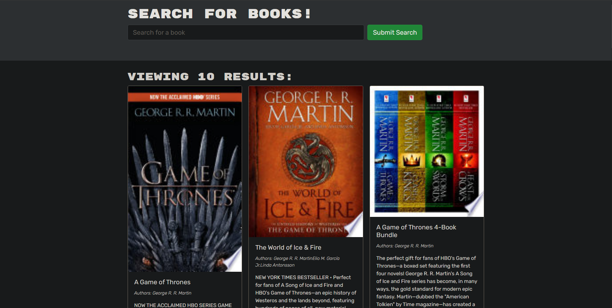

# Book Search Engine

## Description

This application is a book search engine that allows users to create an account and save books to their collection. When a user searches for a book, they will be provided with all of the books that match the input and will be a provided with their title, description, authors, image, and a link.

## Technologies

- Express.js
- Node.js
- MongoDB
- JSONWebToken
- GraphQL
- React.js

## Deployed App

https://desolate-cliffs-04568.herokuapp.com/

## Usage

When a user searches for a book, they will be provided with all of the books that match the input and will be a provided with their title, description, authors, image, and a link.

## Screenshot

## Contact

- Github: [psong1](https://github.com/psong1)

- Email me: paulsong29@gmail.com
